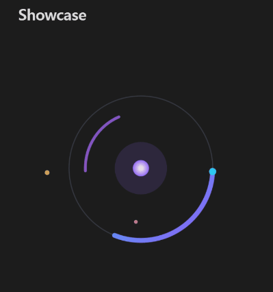

# Lottie

A plugin for [Obsidian](https://obsidian.md) that plays [Lottie](https://lottie.github.io/) animations inside your notes.



## Install

Follow the steps below to install Lottie.

1. Search for "Lottie" in Obsidian's community plugins browser, or open [its page in the plugin directory](https://community.obsidian.md/plugins/lottie) and choose **Add to Obsidian**.
2. Enable the plugin in your Obsidian settings (find "Lottie" under "Community plugins").
3. Turn on **Settings → Files and links → Detect all file extensions** if you want `.json` animations to appear in the file explorer. Embedding them in a note works either way.
4. Optional: pick a renderer under **Settings → Lottie**. Software is the default and works everywhere; WebGL and WebGPU draw on the graphics card.

## Features

- **Embed like an image** — an animation plays where you put it in a note.
- **Size and alignment** — the same syntax images take.
- **Code blocks** — paste an animation's JSON into a `lottie` code block.
- **Open on a tab** — clicking a file in the explorer plays it full pane.
- **Pause and play** — a button on each animation stops it on the current frame.
- **Frame by frame** — a tab has a seek bar, and the arrow keys step one frame.
- **Live updates** — editing an animation in another program updates it in Obsidian straight away.
- **Select rendering backends** — CPU, WebGL or WebGPU, switchable in settings.

## Usage

Embed a `.json` animation the way you would embed an image:

```md
![[spinner.json]]
```

### Size and alignment

```md
![[spinner.json|300]]        300 wide; the height follows the animation's proportions
![[spinner.json|300x100]]    exactly 300 by 100, proportions ignored
![[spinner.json|center]]     left, center or right
![[spinner.json|center|300]] both, with the size last
```

A size always comes last. If you write several alignments the last one is used, and anything that is not one of the three words is ignored.

### Code blocks

To embed an animation without a file, put its JSON in a `lottie` code block:

````md
```lottie
{ "v": "5.7.0", "fr": 30, "ip": 0, "op": 60, "w": 512, "h": 512, "layers": [ ... ] }
```
````

Size and alignment do not apply here. The animation is drawn at the size it was authored at.

### Opening a file on its own

Clicking a `.json` in the file explorer opens the animation on a tab, scaled to fill the pane.

Obsidian hides file types it does not know, so `.json` files will not appear in the explorer until you turn on **Settings → Files and links → Detect all file extensions**. Embedding them in a note works either way.

### Pausing

Every animation has a pause button in its bottom-left corner. It appears when you hover over the animation and stays visible while the animation is paused. Press it again to play on from the same frame. On a touch device the button is always shown.

### Settings

**Renderer** picks what draws the animations:

- **Software** — draws on the CPU. Works everywhere. The default, and the one to go back to if an animation will not play or looks wrong.
- **WebGL** and **WebGPU** — draw on the graphics card. Faster for demanding animations, and noticeably so on mobile.

Changing it redraws everything on screen.

**Autoplay** plays an animation as soon as it appears. It is on by default. With it off, an animation waits on its first frame until you press play.

Animations start paused either way when your system is set to reduce motion.

## Development

```bash
npm install
npm run build
```

`npm run build` produces `main.js` and copies the three release files into `test-vault/`, a scratch vault (not committed) you can open in Obsidian to try the plugin. `npm run dev` builds unminified with an inline source map, and `npm run check` type-checks without building.

Rendering is done by [ThorVG](https://github.com/thorvg/thorvg) through [`@thorvg/webcanvas`](https://www.npmjs.com/package/@thorvg/webcanvas) 1.1.1. Obsidian only installs `main.js`, `manifest.json` and `styles.css` from a release, so `thorvg.wasm` cannot ship beside them: esbuild base64-encodes it into the bundle and it is handed to ThorVG as a blob URL at runtime. Without that, `@thorvg/webcanvas` would fetch the binary from a CDN and the plugin would stop working offline.

## License

MIT — see [LICENSE](LICENSE).

The bundled ThorVG binary statically links RapidJSON (MIT), JerryScript (Apache-2.0) and libwebp (BSD-3-Clause). Compilation strips their notices, so they are reproduced in [THIRD-PARTY-LICENSES.md](THIRD-PARTY-LICENSES.md) and summarised in a header at the top of `main.js`.

`scripts/collect-licenses.mjs` regenerates that file from a checkout of thorvg.web at the tag matching the installed `@thorvg/webcanvas`.
